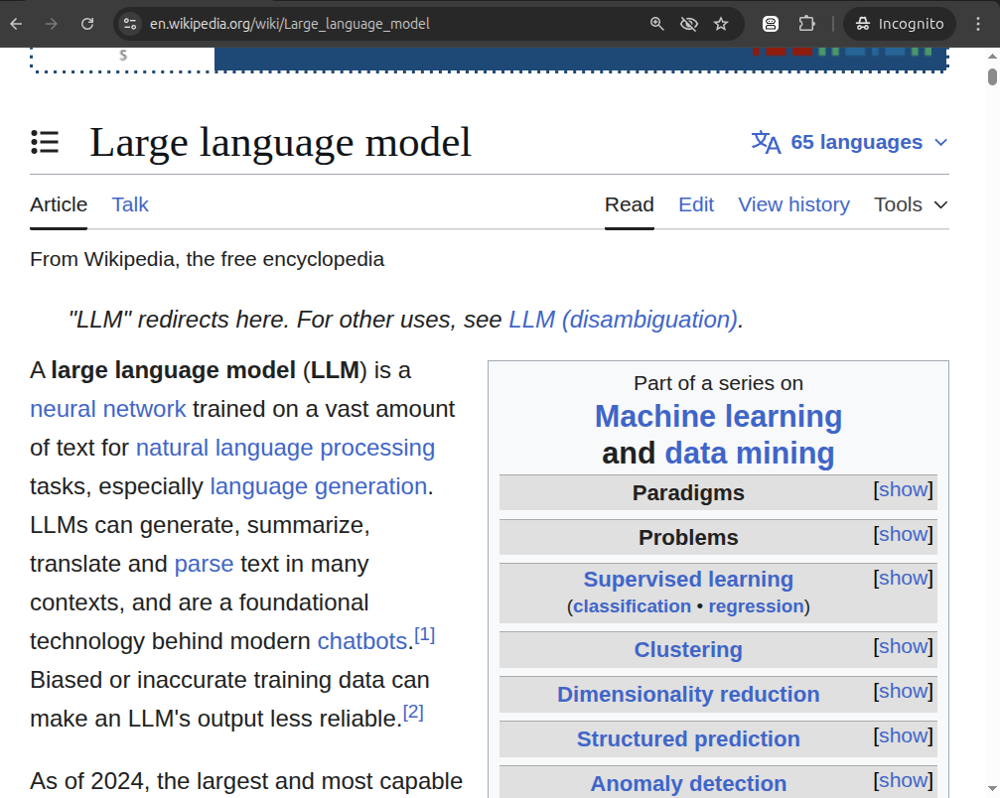
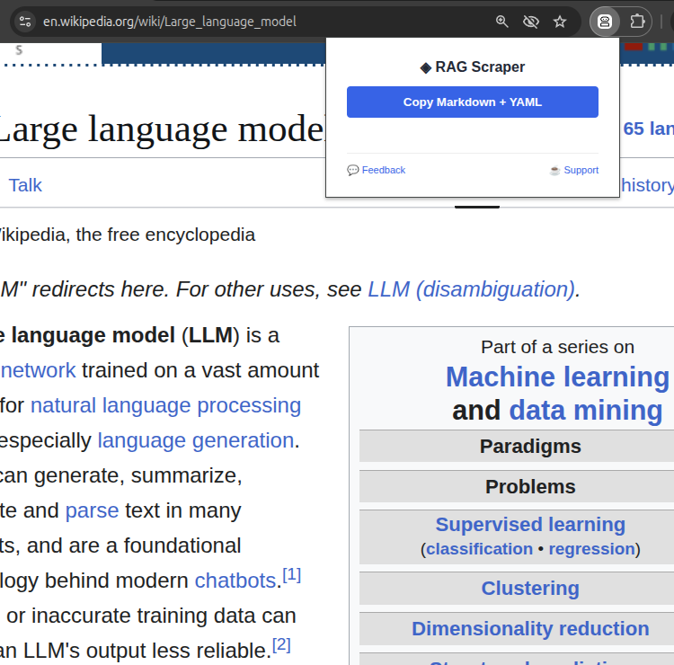
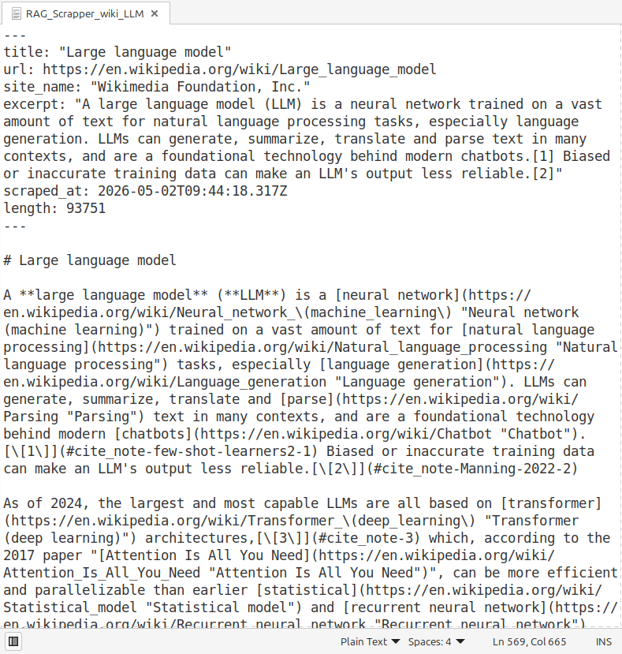

# ◈ RAG Markdown Scraper by ImpKit

**Extract clean, LLM-ready data from any webpage in one click.**

RAG Markdown Scraper is a focused, lightweight browser extension designed for AI engineers, data scientists, and RAG (Retrieval-Augmented Generation) developers. It strips away the web's "noise" and delivers structured Markdown with rich YAML metadata.

---

## 📸 Visual Demo

  
Click to view Visual Demo (Screenshots)

### 1. Identify the target content

### 2. Run the Scraper (One-click)

### 3. Get Structured Markdown + YAML

---

## ✨ Key Features

- **Noise-Free Extraction:** Powered by Mozilla's Readability engine to remove ads, sidebars, and menus.
- **Structural Integrity:** Unique handling of complex and **nested tables** via semantic HTML preservation — no more broken data rows in your LLM context.
- **RAG-Native Metadata:** Automatically generates a YAML frontmatter block with:
  - `title`: Page title (YAML-escaped)
  - `url`: Direct source link
  - `site_name`: Domain or site title
  - `excerpt`: Short summary/description
  - `scraped_at`: ISO 8601 timestamp
  - `length`: Content character count
- **Privacy First:** 100% client-side processing. Your data never leaves your machine. No accounts, no APIs, no tracking.
- **Atomic & Fast:** No bloat, no complex UI. Just the data you need for your LLM context.

## 🧠 Why it's better for RAG?

Standard "Reader Mode" extensions often convert complex tables into a mess of pipes and dashes that small LLMs (like Llama 3 or Mistral) fail to parse correctly. 

**ImpKit Scraper** preserves the hierarchical structure of tables using clean HTML injection within the Markdown. This ensures that:
1. **Nested tables** remain readable.
2. **Contextual relationships** between rows and columns are preserved.
3. **Token usage** is optimized by avoiding redundant markdown formatting characters.

## 🚀 How to Install (Early Access)

Install the extension manually in developer mode:

## 🚀 How to Install (Early Access)

Install the extension manually in developer mode:

1. **Download** the latest clean build: **[rag-markdown-scraper-v0.1.0.zip](https://github.com/impkit/rag-markdown-scraper/releases/download/v0.1.0-alpha/rag-markdown-scraper-v0.1.0.zip)**.
2. **Extract** the ZIP archive to a local folder.
3. Open Chrome and navigate to `chrome://extensions/`.
4. Enable **"Developer mode"** (toggle in the top right).
5. Click **"Load unpacked"** and select the folder where you extracted the files.

## 🛠 Tech Stack

- **Manifest V3** (Chrome Extension API)
- [Readability.js](https://github.com/mozilla/readability) — Content extraction engine by Mozilla.
- [Turndown.js](https://github.com/mixmark-io/turndown) — HTML to Markdown conversion.

---

## ❤️ Support & Community

ImpKit creates atomic, high-utility tools for the AI ecosystem. If this scraper saved you LLM tokens or manual cleanup, feel free to support our development:

- **Solana (SOL):** `4tEi58Phj4VMFn1u3R9ojfLEPz7CbZHtGdmXxsHR17rV`
- **USDT (TRC-20):** `TT5yhYk9tFeazFSBbVxYBofAf1wyMarMBu`

---

- **Feedback:** Found a bug? Have a feature request? Please [open an Issue](https://github.com/impkit/rag-markdown-scraper/issues).
- **Support:** If you are not into crypto, simply **Star ⭐** this repository. Every star helps us grow! **Reach 100 stars to unlock the PRO version features.**
- **Roadmap:** Pro version with batch export, token counter, and custom YAML templates is in development.

## 📬 Contact

Reach us at **impkit.dev@gmail.com** for inquiries or collaboration.

---
*Built with atomic precision by ImpKit Labs.*
