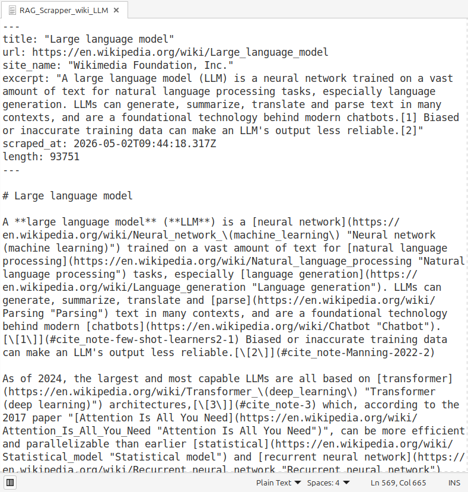

# ◈ RAG Markdown Scraper by ImpKit

**Extract clean, LLM-ready data from any webpage in one click.**

RAG Markdown Scraper is a focused, lightweight browser extension designed for AI engineers, data scientists, and RAG (Retrieval-Augmented Generation) developers. It strips away the web's "noise" and delivers structured Markdown with rich YAML metadata.

---

## 📸 Visual Demo


<details>
  <summary>Click to view Visual Demo (Screenshots)</summary>
  <br />
  <div align="center">
    <table  border="0" cellpadding="10">
      <tr>
        <td align="center" width="33%" valign="top">
          <b>1. Identify target content</b><br />
          
        </td>
        <td align="center" width="33%" valign="top">
          <b>2. Run the Scraper</b><br />
          
        </td>
        <td align="center" width="33%" valign="top">
          <b>3. Get RAG Markdown</b><br />
          
        </td>
      </tr>
    </table>
  </div>
</details>

---

## ✨ Key Features

- **Noise-Free Extraction:** Powered by Mozilla's Readability engine to remove ads, sidebars, and menus.
- **Dual-Pass Table Protection:** Unique placeholder masking prevents Mozilla's engine from corrupting layouts. Tables are injected as clean, deterministic semantic HTML inside Markdown.
- **RAG-Native Metadata:** Automatically generates a YAML frontmatter block with:
  - `title`: Page title (YAML-escaped)
  - `url`: Direct source link
  - `site_name`: Domain or site title
  - `excerpt`: Short summary/description (sanitized from placeholders)
  - `scraped_at`: ISO 8601 timestamp
  - `length`: Content character count
- **Privacy First:** 100% client-side processing. Your data never leaves your machine. No accounts, no APIs, no tracking. Works behind corporate paywalls, intranets, and `localhost`.
- **Atomic & Fast:** No bloat, no complex UI. Just the data you need for your LLM context.

---

## 🧠 Why it's better for RAG? (Proven Stress Tests)

Standard "Reader Mode" extensions and open-source cloud scrapers often convert complex tables into a mess of pipes and dashes, flattening the matrix and destroying cell relations. Small LLMs (like Llama 3 or Mistral) hallucinate heavily on such data. 

**ImpKit Scraper** preserves the absolute semantic hierarchy. Here is how it handles the most brutal edge-cases:

### Test Case 1: Complex Nested Tables
Standard scrapers break the layout completely, shifting rows. ImpKit seals the sub-structure perfectly:
```html
<!-- Input HTML Struct -->
<table border="1">
  <tr><th>Department</th><th>Q1 Performance (Detailed)</th><th>Total Revenue</th></tr>
  <tr>
    <td>Enterprise Sales</td>
    <td><table border="1"><tr><th>Region</th><th>Growth</th></tr><tr><td>North America</td><td>+14%</td></tr></table></td>
    <td>\$1.2M</td>
  </tr>
</table>
```
**ImpKit Validated Output:**
```markdown
<table border="1"><tbody><tr><th>Department</th><th>Q1 Performance (Detailed)</th><th>Total Revenue</th></tr><tr><td>Enterprise Sales</td><td><table border="1"><tbody><tr><th>Region</th><th>Growth</th></tr><tr><td>North America</td><td>+14%</td></tr></tbody></table></td><td>\$1.2M</td></tr></tbody></table>
```

### Test Case 2: Layout Matrix (`colspan` & `rowspan`)
When cells are merged, standard markdown table syntax shifts columns to the left, corrupting values. ImpKit keeps structural coordinates intact:
```markdown
<!-- ImpKit Validated Output -->
<table border="1"><tbody><tr><th rowspan="2">Product ID</th><th colspan="2">Stock Availability</th><th rowspan="2">Status</th></tr><tr><th>EU Hub</th><th>US Hub</th></tr><tr><td>IK-RAG-01</td><td>150 units</td><td>Out of Stock</td><td>Active</td></tr></tbody></table>
```

### Test Case 3: Mixed Block Elements inside Cells (Lists & Code)
Lists with line breaks destroy single-line markdown table rows. ImpKit wraps them cleanly without formatting collisions:
```markdown
<!-- ImpKit Validated Output -->
<table border="1"><tbody><tr><th>Endpoint</th><th>Params</th></tr><tr><td><code>/api/v1/scrape</code></td><td><ul><li><strong>url</strong> (required)</li></ul></td></tr></tbody></table>
```

---

## 🚀 How to Install (Early Access)

Install the extension manually in developer mode:

1. **Download** the latest clean build from the **[Releases page](https://github.com/impkit/rag-markdown-scraper/releases)**.
2. **Extract** the ZIP archive to a local folder.
3. Open Chrome and navigate to `chrome://extensions/`.
4. Enable **"Developer mode"** (toggle in the top right).
5. Click **"Load unpacked"** and select the folder where you extracted the files.

---

### Comparison: Table Handling

| Feature | Generic Scrapers / Reader Modes | ImpKit RAG Scraper (v0.1.1) |
| :--- | :--- | :--- |
| **Nested Tables** | Broken layout / Data loss | **Preserved via Semantic HTML** |
| **Rowspan / Colspan** | Destroyed (Data Shifted) | **100% Geometry Retention** |
| **Lists & Code inside Cells** | Broken Markdown Syntax | **Sanitized HTML Injections** |
| **Auth-Wall / Intranets / Localhost** | Blocked / Inaccessible | **Supported (Local Execution)** |
| **Metadata** | Missing / Generic | **Rich YAML Frontmatter** |

---

### Comparison: Table Handling


| Feature | Generic Scrapers | ImpKit RAG Scraper |
| :--- | :--- | :--- |
| **Nested Tables** | Broken layout / Data loss | **Preserved via Semantic HTML** |
| **Noise (Ads/Menus)** | Often included | **Stripped by Readability engine** |
| **Metadata** | Missing | **Rich YAML Frontmatter** |
| **LLM Context** | Needs manual cleanup | **LLM-Ready (Instant Paste)**


## 🛠 Tech Stack

- **Manifest V3** (Chrome Extension API)
- [Readability.js](https://github.com/mozilla/readability) — Content extraction engine by Mozilla.
- [Turndown.js](https://github.com/mixmark-io/turndown) — HTML to Markdown conversion.

---

## ❤️ Support & Community

ImpKit creates atomic, high-utility tools for the AI ecosystem. If this scraper saved you LLM tokens or manual cleanup, feel free to support our development:

- **Solana (SOL):** `4tEi58Phj4VMFn1u3R9ojfLEPz7CbZHtGdmXxsHR17rV`
- **USDT (TRC-20):** `TT5yhYk9tFeazFSBbVxYBofAf1wyMarMBu`

---

- **Feedback:** Found a bug? Have a feature request? Please [open an Issue](https://github.com/impkit/rag-markdown-scraper/issues).
- **Support:** If you are not into crypto, simply **Star ⭐** this repository. Every star helps us grow! **Reach 100 stars to unlock the PRO version features.**
- **Roadmap:** Pro version with batch export, token counter, and custom YAML templates is in development.

## 📬 Contact

Reach us at **impkit.dev@gmail.com** for inquiries or B2B data cleaning collaboration.

---
*Built with atomic precision by ImpKit Labs.*
